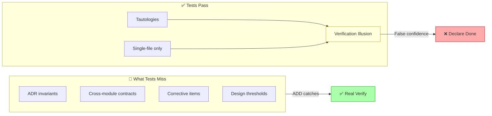
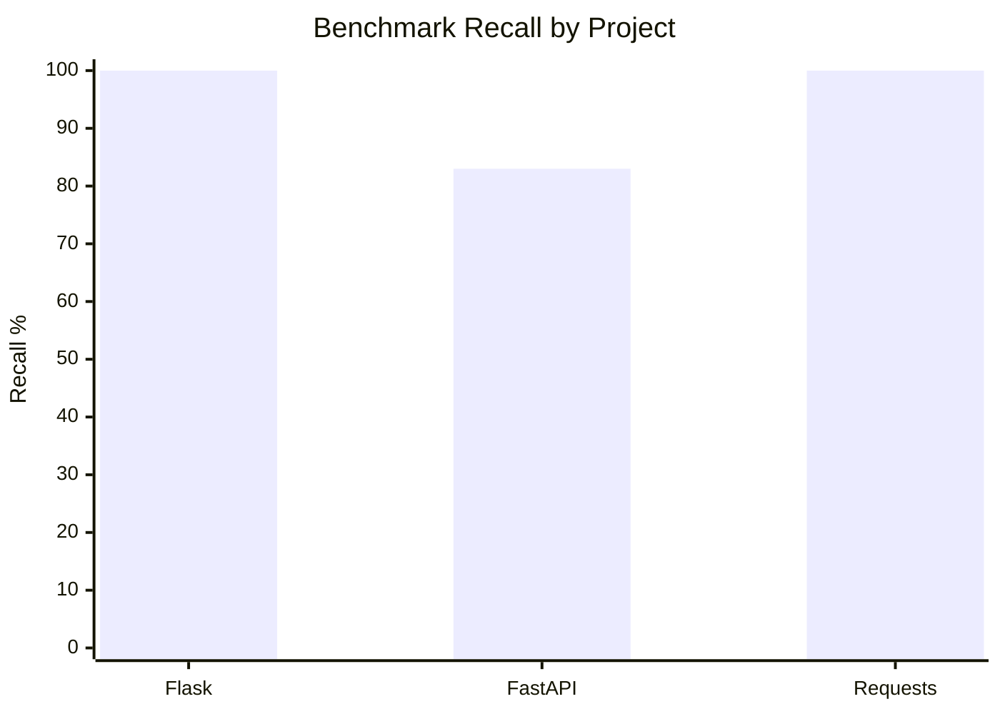
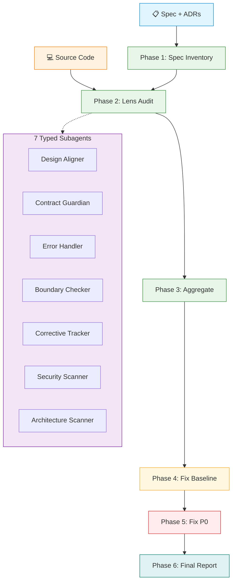
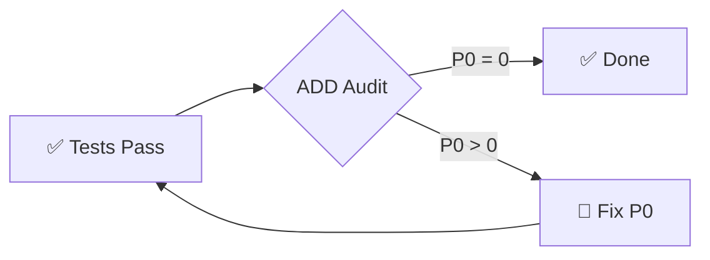
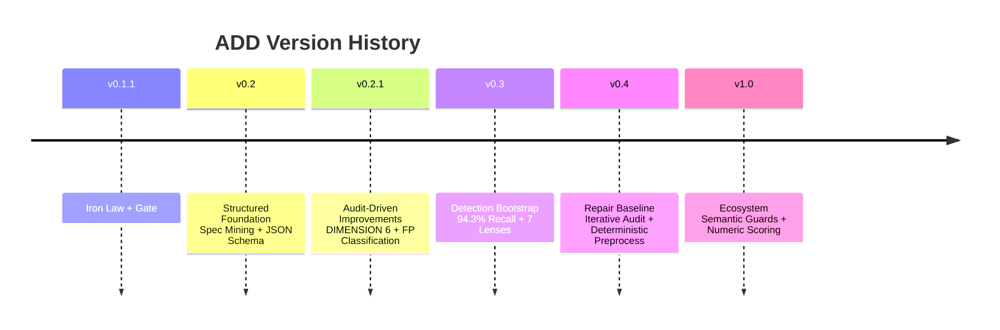

# Audit-Driven Development

> **Tests passing is necessary. It is not sufficient.**
> **测试通过是必要的。但不是充分的。**

<p align="center">
  <a href="https://github.com/StormstoutLau/audit-driven-development"></a>
  <a href="https://opensource.org/licenses/MIT"></a>
  <a href="https://github.com/StormstoutLau/audit-driven-development"></a>
  <a href="https://github.com/StormstoutLau/audit-driven-development/tree/main/docs/benchmark"></a>
</p>

<p align="center">
  
  
  
  
</p>

A Trae Skill that enforces an independent audit phase between implementation and done. It scores code against design specs, identifies blind spots tests cannot catch, and produces a fix priority matrix.

**Detection** finds misalignment. **Repair** closes the loop.

---

## The Problem

> **"164 tests passed"** is the most dangerous phrase in software.



Tests verify behavior within a single module. They cannot verify that Module A follows the contract Module B expects — or that the dependency graph still holds — or that the threshold in the spec matches the one in the code.

ADD sits **between implementation and done** — an independent verification pass that treats the design spec as the source of truth, not the test suite.

---

## Proof

Three open-source projects, audited by ADD. Results verified against known bug databases.

| Project | Version | Bugs | Found | Recall | Precision | F₁ |
|---|---|---|---|---|---|---|
| Flask | 3.1.2 | 3 | 3 | **100%** | 89% | 94.1% |
| FastAPI | 0.115.8 | 6 | 5 | **83%** | 85% | 83.9% |
| Requests | 2.33.0 | 4 | 4 | **100%** | 100% | 100% |



| Average Recall | Average Precision | Average F₁ |
|---|---|---|
| **94.3%** | **91.3%** | **92.6%** |

The one remaining false negative — an AfterValidator annotation propagation bug in FastAPI 0.115.8 — was traced to its root cause via MCP search and written as a reusable detection rule. [See reference →](references/python-pydantic-audit-rules.md)

---

## Architecture



**Detection side** (green): Phases 1–3 — Spec inventory, lens-audit, aggregate findings.
**Repair side** (amber/red/teal): Phases 4–6 — Baseline, fix P0, final report.

### The 7 Lenses

Each lens is a typed subagent prompt. Five are always active; two are opt-in via `--lens`.

| Lens | Subagent | Checks |
|---|---|---|
| 🧬 Design Alignment | Design Aligner | Signature + behavior consistency vs spec |
| 🔗 Cross-Module Contract | Contract Guardian | ADR invariants, dependency graph, entry points |
| 🛡️ Error Handling | Error Handler | Exception coverage, propagation, retry logic |
| 🔲 Boundary Conditions | Boundary Checker | Input validation, null checks, edge cases |
| 📝 Corrective Tracking | Corrective Tracker | Spec corrective items reflected in code |
| 🔐 Security Scanning | `--lens security` | XSS, injection, path traversal, secrets |
| 🏗️ Architecture Health | `--lens architecture` | Circular deps, layer violations, dead imports |

### The Scripts

| Script | Does |
|---|---|
| `audit_files.py` | Deterministic file selection — no AI hallucination |
| `rule_index.py` | Constraint index — must/must-not/threshold extraction |
| `verify_lines.py` | Evidence pointer verification — keyword match ±20 lines |
| `issues_tracker.py` | State machine — `open → in_progress → fixed → verified` |
| `score_tracker.py` | 0–100 numeric scoring + ASCII trend chart |
| `merge_guards.py` | Cross-project guard merge — project overrides common |

---

## The Iron Law

> ```
> NO "IMPLEMENTATION COMPLETE" WITHOUT AN AUDIT-DRIVEN REVIEW
> ```

The audit phase is **mandatory**. Not optional. Not "if we have time."

Tests passing is the gate to audit. Audit passing is the gate to done.

---

## When to Use



| Invoke ADD when | Do not use for |
|---|---|
| Multi-module plan is complete | General code quality → `code-review-excellence` |
| Cross-module contracts need verification | Single-task TDD → `test-driven-development` |
| Design doc version upgrade | Implementation planning → `writing-plans` |
| Regression baseline after fix sprint | |

ADD is orthogonal. It complements code review and TDD by verifying a dimension neither covers: **alignment between what the spec says and what the code does**.

---

## Quick Start

```bash
# In any AI coding tool (Trae / Claude Code / Cursor / Codex):
Audit the current implementation against the design specs.

# What happens: 6-phase automated audit → fix priority matrix → issues.json
```

**After the report:**

```bash
# Fix tracking
python scripts/issues_tracker.py init docs/audit/<report>.json
python scripts/issues_tracker.py status --id <ID> --to in_progress
# ... fix the code (human) ...
python scripts/issues_tracker.py status --id <ID> --to fixed
python scripts/issues_tracker.py verify --file <fixed_file>

# Scoring
python scripts/score_tracker.py compute docs/audit/issues.json --project <name> --version <tag>
python scripts/score_tracker.py trend docs/audit/scores.json
```

---

## Installation

<p align="center">
  
  
  
  
  
  
  
</p>

| Tool | Adapter File | Install Path |
|---|---|---|
| **Trae** | `SKILL.md` | `.trae/skills/audit-driven-development/` |
| **Claude Code** | `adapters/claude-code/SKILL.md` | `.claude/skills/audit-driven-development/` |
| **Cursor** | `adapters/cursor/audit-driven-development.mdc` | `.cursor/rules/` |
| **Codex** | `adapters/codex/AGENTS.md` | `AGENTS.md` (project root) |
| **GitHub Copilot** | `adapters/github-copilot/copilot-instructions.md` | `.github/copilot-instructions.md` |
| **Windsurf** | `adapters/windsurf/.windsurfrules` | `.windsurfrules` (project root) |
| **OpenCode** | `adapters/opencode/AGENTS.md` | `AGENTS.md` (project root) |

All adapters auto-synced from `SKILL.md` via `scripts/sync_adapters.py`.

---

## Development

Built over 5 versions, each independently shippable, each passing full TDD regression.



| Version | Detection | Repair |
|---|---|---|
| v0.1.1 | Iron Law + Gate | — |
| v0.2 | Spec Mining + JSON Schema | — |
| v0.2.1 | DIMENSION 6 + FP Classification | — |
| v0.3 | 94.3% Benchmark + 7 Lenses | State Machine + `--verify` |
| v0.4 | Deterministic Preprocess + Iterative Audit | Structured `fix_suggestion` |
| v1.0 | Semantic Guards + Numeric Scoring | Cross-project Guard Reuse |

**TDD**: 96/96 checks across 4 test suites. **Perf**: 94.3% recall across 3 OSS projects.

---

## License

[MIT](./LICENSE) © 2026 StormstoutLau
