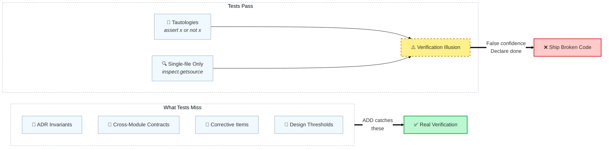
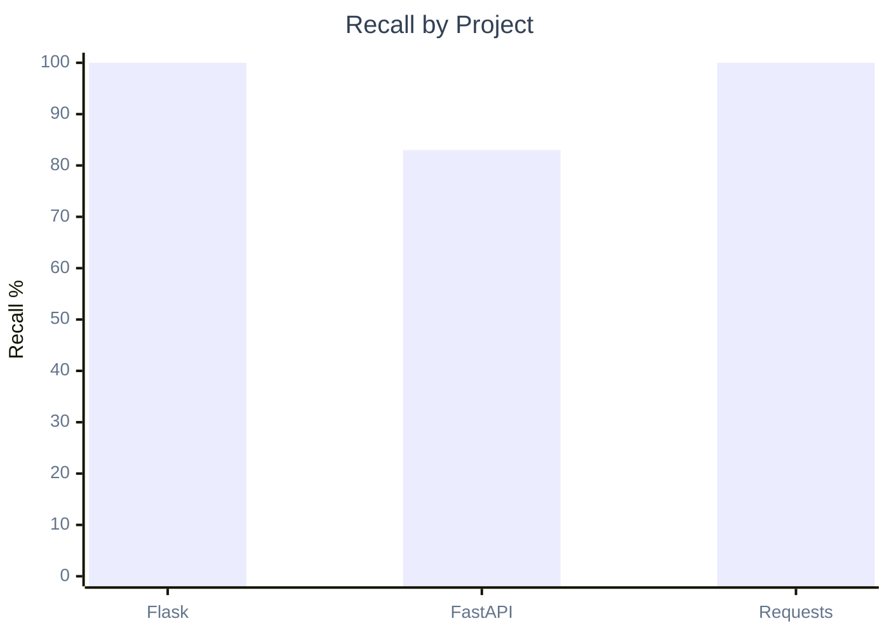
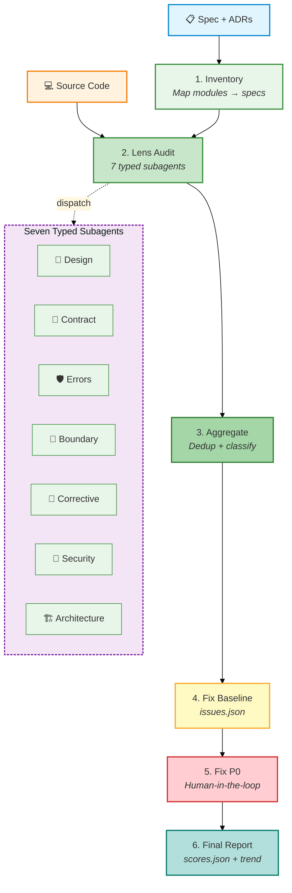
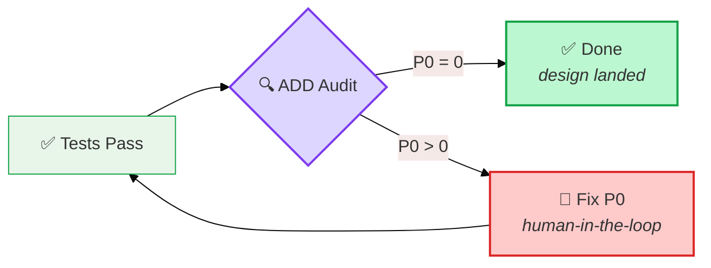
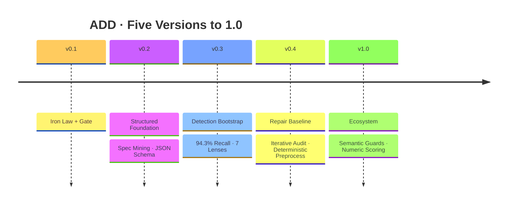

<div align="center">

# Audit-Driven Development

**Tests pass → Code ships.**  That is the lie every team tells itself.\
**测试通过就上线。** 这是每支团队对自己说的谎。

<br>

<a href="https://github.com/StormstoutLau/audit-driven-development">
  
</a>
<a href="https://opensource.org/licenses/MIT">
  
</a>
<a href="https://github.com/StormstoutLau/audit-driven-development">
  
</a>

<br>
<br>

<table align="center">
<tr>
  <td align="center"><b>Detection</b></td>
  <td align="center"><b>Repair</b></td>
  <td align="center"><b>Benchmark</b></td>
  <td align="center"><b>Adapters</b></td>
</tr>
<tr>
  <td align="center"></td>
  <td align="center"></td>
  <td align="center"></td>
  <td align="center"></td>
</tr>
</table>

<br>

> A Trae Skill that inserts an independent audit phase **between implementation and done**. \
> Detection finds what tests miss. Repair closes what detection finds.

</div>

---

## The Problem

> **"164 tests passed"** is the most dangerous phrase in software.



Tests verify behavior within a single module. They cannot verify that Module A keeps the promises Module B depends on — or that the dependency graph still holds — or that the threshold in the spec matches the threshold in the code.

**ADD treats the design spec as the source of truth.** Not the test suite.

---

## Proof

Three open-source projects, audited by ADD. Findings verified against known bug databases.

<table align="center">
<tr>
  <td align="center"><h3>Flask 3.1.2</h3></td>
  <td align="center"><h3>FastAPI 0.115.8</h3></td>
  <td align="center"><h3>Requests 2.33.0</h3></td>
</tr>
<tr>
  <td align="center">
    <br>
    <sub>3/3 bugs found · F₁ 94.1%</sub>
  </td>
  <td align="center">
    <br>
    <sub>5/6 bugs found · F₁ 83.9%</sub>
  </td>
  <td align="center">
    <br>
    <sub>4/4 bugs found · F₁ 100%</sub>
  </td>
</tr>
</table>



<table align="center">
<tr>
  <td align="center"><b>Avg Recall</b><br><h2>94.3%</h2></td>
  <td align="center"><b>Avg Precision</b><br><h2>91.3%</h2></td>
  <td align="center"><b>Avg F₁</b><br><h2>92.6%</h2></td>
</tr>
</table>

The one remaining false negative — an AfterValidator propagation bug in FastAPI — was traced to its root cause via MCP search and written as a reusable detection rule. [→ reference](references/python-pydantic-audit-rules.md)

---

## Architecture



| Phase | Side | What |
|---|---|---|
| 1–3 | **Detection** (green) | Spec inventory → Lens audit → Aggregate findings |
| 4–6 | **Repair** (amber→red→teal) | Baseline → Fix P0 → Final report |

### The Seven Lenses

Each lens is a typed subagent prompt. Five always active. Two opt-in via `--lens`.

| | Lens | Specializes In |
|---|---|---|
| 🧬 | Design Alignment | Signature + behavior match vs spec |
| 🔗 | Cross-Module Contract | ADR invariants · dependency graph · entry points |
| 🛡️ | Error Handling | Exception coverage · propagation · retry logic |
| 🔲 | Boundary Conditions | Input validation · null checks · edge cases |
| 📝 | Corrective Tracking | Spec corrective items reflected in code |
| 🔐 | Security Scanning `--lens security`  | XSS · injection · path traversal · secrets |
| 🏗️ | Architecture Health `--lens architecture` | Circular deps · layer violations · dead imports |

### The Scripts

| Script | Does |
|---|---|
| `audit_files.py` | Deterministic scope — zero AI hallucination |
| `rule_index.py` | Constraint extraction — must / must-not / threshold |
| `verify_lines.py` | Evidence check — keyword match ±20 lines |
| `issues_tracker.py` | State machine — `open → in_progress → fixed → verified` |
| `score_tracker.py` | 0–100 scoring + ASCII trend chart |
| `merge_guards.py` | Guard merge — project overrides common by id |

---

## The Iron Law

> # "NO IMPLEMENTATION COMPLETE" WITHOUT AN AUDIT-DRIVEN REVIEW

The audit phase is **mandatory**. Not optional. Not "if we have time."

> Tests passing is the gate **to** audit. Audit passing is the gate **to** done.



---

## When to Use

<table>
<tr><th>✅ Invoke ADD</th><th>❌ Use Another Skill</th></tr>
<tr valign="top">
<td>

- Multi-module plan is complete
- Cross-module contracts need verification
- Design doc version upgrade
- Regression baseline after fix sprint

</td>
<td>

- General code quality → `code-review-excellence`
- Single-task TDD → `test-driven-development`
- Implementation planning → `writing-plans`

</td>
</tr>
</table>

ADD is orthogonal. It complements code review and TDD by verifying the dimension neither covers: **alignment between what the spec says and what the code does**.

---

## Quick Start

```bash
# One command. In any AI coding tool.
Audit the current implementation against the design specs.

# What happens: 6-phase automated audit → priority matrix → issues.json
```

**After the report:**

```bash
# Track fixes through the state machine
python scripts/issues_tracker.py init docs/audit/<report>.json
python scripts/issues_tracker.py status --id BRIDGE-P0-1 --to in_progress
  # ... fix the code (this is the HUMAN step) ...
python scripts/issues_tracker.py status --id BRIDGE-P0-1 --to fixed
python scripts/issues_tracker.py verify --file bridge/__init__.py

# Compute and track scores over time
python scripts/score_tracker.py compute docs/audit/issues.json --project MyApp --version v0.2.0
python scripts/score_tracker.py trend docs/audit/scores.json
```

---

## Installation

<p align="center">
  
  
  
  
  
  
  
</p>

| Tool | Adapter | Path |
|---|---|---|
| Trae | `SKILL.md` | `.trae/skills/audit-driven-development/` |
| Claude Code | `adapters/claude-code/SKILL.md` | `.claude/skills/audit-driven-development/` |
| Cursor | `adapters/cursor/audit-driven-development.mdc` | `.cursor/rules/` |
| Codex | `adapters/codex/AGENTS.md` | `AGENTS.md` |
| Copilot | `adapters/github-copilot/copilot-instructions.md` | `.github/copilot-instructions.md` |
| Windsurf | `adapters/windsurf/.windsurfrules` | `.windsurfrules` |
| OpenCode | `adapters/opencode/AGENTS.md` | `AGENTS.md` |

All adapters auto-synced from `SKILL.md` via `scripts/sync_adapters.py`.

---

## Development



| Version | Detection Side | Repair Side |
|---|---|---|
| v0.1.1 | Iron Law + Gate | — |
| v0.2 | Spec Mining + JSON Schema | — |
| v0.2.1 | DIMENSION 6 + FP Classification | — |
| v0.3 | 94.3% Benchmark + 7 Lenses | State Machine + `--verify` |
| v0.4 | Deterministic Preprocess + Iterative Audit | Structured `fix_suggestion` |
| v1.0 | Semantic Guards + Numeric Scoring | Cross-project Guard Reuse |

> **TDD**: 96/96 checks across 4 test suites, all passing. **Perf**: 94.3% recall across 3 OSS projects.

---

## License

[MIT](./LICENSE) © 2026 StormstoutLau
