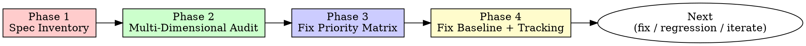

# Audit-Driven Development

## Overview

After implementation, verify code matches design. Find gaps. Fix blockers. Prevent regression.

**Core principle:** Implementation完成 ≠ 设计落地。审查是"代码与设计文档对齐"的独立环节，与"代码质量审查"（code-review-excellence）正交。

**与 executing-plans / test-driven-development 的关系**：
- executing-plans 覆盖"如何实施"
- test-driven-development 覆盖"如何写单 Task 测试"
- **audit-driven-development 覆盖"实施后如何验证整体与设计对齐"** ← 独有环节

## When to Use

**Always invoke when:**
- 多模块实施计划完成后（如 15 Task 全部 done）
- 用户问"检查代码质量与设计文档对齐"
- 跨模块契约需要验证（如依赖图不变式）
- 修复后的回归基线需要建立
- 设计文档版本升级（如 v0.1.0 → v0.1.1）需要审查影响

**Do NOT use for:**
- 通用代码质量审查（用 code-review-excellence）
- 单 Task TDD 流程（用 test-driven-development）
- 实施计划编写（用 writing-plans）
- 实施计划执行（用 executing-plans）

## The Iron Law

```
NO "IMPLEMENTATION COMPLETE" WITHOUT AN AUDIT-DRIVEN REVIEW
```

164 tests passed 不等于设计落地。测试通过是必要非充分条件。

**测试覆盖不到的 4 类盲区**（必须在审查中识别）：
1. 断言恒真式（assertion always true）
2. 单文件检查盲区（`inspect.getsource()` 看不到跨文件传递依赖）
3. 设计文档独有约束无测试（如 ADR 不变式、策略 G/K）
4. 修正阻断性项无测试（如先行者偏差防护、逃生舱独立检测）

## Pre-Audit: Spec Quality Gate (Phase 0) / 设计文档质量门 (Phase 0)

**Goal / 目标**: Assess spec quality before auditing. Prevent GIGO (garbage spec → garbage audit).
在设计文档盘点之前评估 spec 质量，防止 GIGO（垃圾 spec → 垃圾审计）。

**Added in v0.1.1** in response to Limitation 1 (skill relies on spec quality). See `docs/ROADMAP.md` P0.2.
**v0.1.1 新增**，回应局限 1（skill 依赖 spec 质量）。见 `docs/ROADMAP.md` P0.2。

### Spec Quality Checklist / Spec 质量检查清单

Score each spec doc against 5 dimensions (0 or 1 point each, max 5):
对每份 spec 文档按 5 维度评分（每项 0 或 1 分，满分 5）:

| # | Dimension / 维度 | Question / 问题 | 1 Point If / 得 1 分条件 |
|---|---|---|---|
| 1 | Testable Constraints / 可测试约束 | Does the spec contain "must" / "must not" / numeric thresholds? spec 是否含"必须"/"禁止"/数值阈值？ | ≥3 testable constraints found / 找到 ≥3 条可测试约束 |
| 2 | Module Mapping / 模块映射 | Does each module have a 1:1 spec section? 每个模块是否有 1:1 对应的 spec 章节？ | All modules mapped / 所有模块均有映射 |
| 3 | Interface Contracts / 接口契约 | Are function signatures, params, return values specified? 函数签名、参数、返回值是否明确？ | ≥80% of public functions specified / ≥80% 公开函数有规范 |
| 4 | Corrective Items / 修正项 | Does the spec list "fix 9.x" or equivalent corrective actions? spec 是否列出"修正 9.x"或等价修正项？ | Corrective items enumerated / 修正项已枚举 |
| 5 | Cross-Module Contracts / 跨模块契约 | Are ADR invariants / dependency graph rules documented? ADR 不变式 / 依赖图规则是否记录？ | ≥1 ADR or equivalent / 至少 1 份 ADR 或等价物 |

### Tier Assignment / 分档判定

| Tier / 档位 | Score / 得分 | Audit Mode / 审计模式 | Action / 动作 |
|---|---|---|---|
| **A** | 4-5 | **Full audit** (Phases 1-4) | Proceed to Phase 1 / 进入 Phase 1 |
| **B** | 2-3 | **Structural audit** | Downgrade: audit code vs general engineering principles (DAG acyclic, single entry, error handling complete). Flag "spec gaps prevent full audit" in report. / 降级：审查代码 vs 通用工程原则（依赖图无环、单一入口、错误处理完备）。报告中标注"spec 缺口导致无法完整审计"。 |
| **C** | 0-1 | **Spec Mining** (v0.2) or **Refuse** | v0.2: invoke Spec Mining Fallback (P1.5). v0.1.1: refuse audit with reason "spec quality too low, cannot audit". / v0.2：调用 Spec Mining Fallback (P1.5)。v0.1.1：拒绝审计，理由"spec 质量过低，无法审计"。 |

### Why This Gate Matters / 为何需要此门

Without Phase 0, the skill gives false A+ scores when the spec is trivially satisfied (because the spec says nothing). This is the GIGO failure mode.

没有 Phase 0，当 spec 空洞时，skill 会给出虚假的 A+ 评分（因为 spec 什么都没说，代码自然"对齐"）。这是 GIGO 失效模式。

**Rule / 规则**: If Phase 0 tier is B or C, the audit report MUST state the tier and its limitation. A B-tier audit cannot issue an A+ score (capped at B+).

**规则**：若 Phase 0 档位为 B 或 C，审计报告必须声明档位及其限制。B 档审计不能给出 A+ 评分（上限为 B+）。


## The Audit Framework: 4 Phases



### Phase 1: Spec Inventory (设计文档盘点)

**Goal**: 列出所有需要审查的"对齐维度"

1. **收集所有设计文档**（spec 文件、ADR、架构文档）
2. **为每个文档标记版本状态**: `draft / audited / revised`
3. **为每个模块识别对应的 spec**:
   - 模块 → spec 文件 → spec 章节
4. **识别跨模块契约**: ADR 不变式、接口契约、依赖图

**Output**: 审查维度清单（每维度 = 1 模块 vs 1 spec + N 跨模块契约）

### Phase 2: Multi-Dimensional Audit (多维度审查)

**Goal**: 对每个维度执行对齐审查，识别问题

**派发 subagent 并行审查**（每个模块 1 个 subagent + 跨模块契约 1 个 subagent）：

每个 subagent 的任务：
1. 读取模块代码 + 对应 spec
2. 逐章节核对：spec 说"做什么" vs 代码"做了什么"
3. 检查签名一致性（方法名、参数、返回值）
4. 检查行为一致性（策略、阈值、不变式）
5. 检查修正项落实（spec 中的"修正 9.x"是否在代码中体现）
6. 识别测试盲区

**Output per dimension**: 审查报告（评分 + 问题列表 + 测试盲区）

### Phase 3: Fix Priority Matrix (修复优先级矩阵)

**Goal**: 按"影响×成本"排序所有问题，识别 Tier 1

**问题分级**:
| 级别 | 含义 | 必须修复 |
|---|---|---|
| **P0 Blocker** | 阻断核心功能 / 违反不变式 / 数据丢失 | 立即 |
| **P1 Critical** | 策略失效 / 严重 bug / 测试盲区 | 本轮 |
| **P2 Major** | 行为偏差 / 性能问题 / 文档不一致 | 下一轮 |
| **P3 Minor** | 命名 / 注释 / 风格 | 可选 |

**修复 Tier**:
- **Tier 1**: P0 Blocker（全部修复）
- **Tier 2**: P1 Critical + 低成本 P2（如 1 行修复）
- **Tier 3**: 剩余 P2 + P3

**排序启发式**:
1. 阻断性问题 > 严重问题 > 中度问题
2. 1 行修复的 P0 优先于 100 行重构的 P1
3. 影响多模块的问题优先于单模块问题
4. 修正项未落实优先于新增问题（修正项是设计承诺）

### Phase 4: Fix Baseline + Tracking (修复基线 + 跟踪表)

**Goal**: 建立修复基线，防止回归

1. **写入审查报告**: `docs/audit/YYYY-MM-DD-code-quality-audit.md`
2. **修复跟踪表**:

```markdown
| 编号 | 严重度 | 描述 | 状态 | 提交 | 测试验证 |
|---|---|---|---|---|---|
| P0-1 | Blocker | xxx | ✅ 已修复 | commit_hash | 164 tests passed |
| P0-2 | Blocker | yyy | 🚧 修复中 | - | - |
| P1-1 | Critical | zzz | ⬜ 待修复 | - | - |
```

3. **每项修复后立即重跑测试**（零回归原则）
4. **修复完成后更新审查报告**（状态 → ✅，提交 commit_hash）

## Scoring System

每个维度评分（A+ 到 F）:

| 评分 | 含义 | 标准 |
|---|---|---|
| **A+** | 完美对齐 | 0 P0/P1, ≤2 P2 |
| **A** | 优秀 | 0 P0/P1, ≤5 P2 |
| **A-** | 良好 | 0 P0, ≤2 P1 |
| **B+** | 合格 | 0 P0, ≤4 P1 |
| **B** | 基本合格 | 0 P0, ≤6 P1 |
| **B-** | 勉强合格 | 0 P0, 任意 P1 数 |
| **C+** | 不合格 | 1+ P0 修复后 |
| **C** | 严重不合格 | 多项 P0 |
| **F** | 灾难性 | 设计与实现完全脱节 |

**修复后预期评分提升**必须在审查报告中标注（如 Memory: C+ → B+）。

## ADR Dependency Graph Invariants

ADR（架构决策记录）定义的依赖图不变式是审查的核心。检查方法：

### 1. 静态依赖检查（必须）

```bash
# 检查禁止的 import 关系
grep -r "from factor_miner.memory" factor_miner/bridge/  # 应为空
grep -r "from factor_miner.generator" factor_miner/bridge/  # 应为空
```

### 2. 动态依赖检查（必须）

```python
# 用 inspect.getsource() 检查单文件是不够的！
# 必须检查传递依赖链：
# bridge → generator → memory  # 反例，违反 ADR
```

### 3. TYPE_CHECKING 守卫模式

消除静态依赖边的标准模式：

```python
from __future__ import annotations
from typing import TYPE_CHECKING

if TYPE_CHECKING:
    from factor_miner.memory.data_structures import P_succRecord  # 仅类型注解，运行时不导入
```

**审查规则**: 如果 `data_structures.py` 需要 import 其他模块的类型，必须用 `TYPE_CHECKING` 守卫，否则违反依赖图不变式。

### 4. 两个唯一入口原则

检查以下不变式:
- **Memory 写入**: 只有 orchestrator 调用 `memory.write_*()`
- **Registry 算子调用**: 只有 DSL interpreter 调用 `registry.get()`

## Test Blind Spot Detection

测试通过 ≠ 设计落地。每项 P0/P1 修复后必须检查测试盲区：

### 盲区 1: 断言恒真式
```python
# ❌ 错误示例：恒真式
assert report.success or not report.success  # 永远 True
# ✅ 正确：具体值
assert report.success is True
assert report.decision == "p_succ_candidate"
```

### 盲区 2: 单文件检查盲区
```python
# ❌ inspect.getsource(Bridge.evaluate) 只看单文件
# ✅ 必须检查跨文件传递依赖：
#    bridge.py import generator.data_structures
#    generator.data_structures import memory.data_structures
#    → bridge → memory 传递依赖（违反 ADR）
```

### 盲区 3: 设计文档独有约束无测试
- ADR 不变式（依赖图、唯一入口）
- 策略 G（跨 session 隔离）
- 策略 K（归档触发条件）
- 策略 E（双门决策矩阵）

**必须新增端到端契约测试**覆盖这些约束。

### 盲区 4: 修正阻断性项无测试
- 修正 9.1（先行者偏差防护）→ 必须有 cutoff 测试
- 修正 9.7（逃生舱独立 AST 检测）→ 必须有 LLM 自我声明错误的测试
- 修正 9.10（schema_version）→ 必须有版本字段测试

## Templates

### Template 1: 审查报告骨架

```markdown
# 代码质量与设计文档对齐审查报告

**日期**: YYYY-MM-DD
**审查范围**: <项目名> v<版本>
**审查基线**: <commit_hash>

## 0. 修复跟踪表

| 编号 | 严重度 | 模块 | 描述 | 状态 | 提交 | 测试验证 |
|---|---|---|---|---|---|---|
| P0-1 | Blocker | xxx | yyy | ⬜/🚧/✅ | - | - |

## 1. 审查范围与方法

### 1.1 设计文档清单
- <doc1> (v<version>)
- <doc2> (v<version>)

### 1.2 审查维度
- 维度 1: <module> vs <spec>
- 维度 N: 跨模块契约 (ADR-xxx + Architecture §x)

### 1.3 审查方法
- Subagent-Driven 并行审查
- 每维度独立评分
- 跨维度问题汇总

## 2. 模块审查结果

### 2.1 <Module> 模块 (评分: X)

#### 严重问题
- P0-1: <描述>
  - 位置: <file:line>
  - 不一致: <spec 说 X，代码做 Y>
  - 影响: <导致 Z 失效>
  - 修复建议: <具体方案>

#### 中度问题
- ...

#### 轻微问题
- ...

#### 测试盲区
- ...

## 3. 跨模块契约审查

### 3.1 ADR-001 依赖图不变式
- ✅/❌ <不变式 1>
- ✅/❌ <不变式 2>

### 3.2 接口契约
- ...

## 4. 修复优先级矩阵

### Tier 1: P0 Blocker (立即修复)
1. P0-1: <描述> (修复成本: 1 行 / 影响范围: 全局)

### Tier 2: P1 Critical + 低成本 P2
...

### Tier 3: 剩余 P2 + P3
...

## 5. 测试盲区汇总
...

## 6. 修复后预期评分提升
- <Module>: X → Y
- ...

## 7. 下一步建议
- A. 修复 P0 阻断性问题
- B. 新增契约测试覆盖盲区
- C. 修复 P1 严重问题
```

### Template 2: 修复提交信息

```
fix: resolve N P0 blockers from code quality audit

修复代码质量审查发现的 N 项阻断性问题，<test_count> tests passed 零回归。

## 修复内容

### <Module> (N 项)
- P0-1: <修复内容>
  原因：<为什么会有这个问题>
  修复：<具体改了什么>

...

## 测试验证

<test_count> tests passed (零回归)

## 文档

更新 docs/audit/YYYY-MM-DD-code-quality-audit.md 修复跟踪表。
```

## Process: Step-by-Step

### Step 1: Inventory
1. 收集所有设计文档（spec / ADR / 架构文档）
2. 列出模块清单 + 对应 spec
3. 识别跨模块契约（ADR 不变式、接口契约）
4. 创建 TodoWrite 跟踪审查任务

### Step 2: Audit (Parallel Subagents)
**对每个模块派发独立 subagent**:
- 输入：模块代码 + 对应 spec
- 输出：评分 + 问题列表 + 测试盲区

**跨模块契约审查派发独立 subagent**:
- 输入：ADR + 架构文档 + 所有模块代码
- 输出：不变式违反列表 + 传递依赖链

### Step 3: Aggregate + Prioritize
1. 汇总所有 subagent 报告
2. 按 P0/P1/P2/P3 分级
3. 按 Tier 1/2/3 排序
4. 识别"低成本高影响"修复（1 行修复的 P0 优先）

### Step 4: Fix Baseline
1. 写入 `docs/audit/YYYY-MM-DD-code-quality-audit.md`
2. 填充修复跟踪表（状态 ⬜）
3. 提交基线 commit

### Step 5: Fix P0 Blockers (Iterative)
1. 按修复成本排序 Tier 1（1 行修复优先）
2. 逐项修复
3. 每项修复后立即重跑测试
4. 更新跟踪表（状态 ✅ + commit_hash）

### Step 6: Final Report
1. 更新审查报告（所有 P0 状态 ✅）
2. 标注修复后预期评分提升
3. 提交最终 commit
4. 输出下一步选项（契约测试 / P1 修复 / 实证阶段）

## Critical Anti-Patterns

### ❌ 反模式 1: "测试通过就行"
164 tests passed 是假象。测试盲区（断言恒真式、单文件检查、设计约束无测试）让测试通过失去意义。

### ❌ 反模式 2: "修复后不重跑"
每项 P0 修复后必须重跑全部测试。零回归是硬约束。

### ❌ 反模式 3: "审查后不建立基线"
审查报告必须写入 `docs/audit/`，作为修复基线。口头审查不算数。

### ❌ 反模式 4: "P0 和 P1 一起修"
先修完所有 P0（Tier 1），再修 P1（Tier 2）。混修会让回归定位困难。

### ❌ 反模式 5: "只看单文件"
`inspect.getsource()` 看不到传递依赖。必须用 grep / ast 分析跨文件依赖链。

## Boundaries with Other Skills

| 能力 | 由本 skill 覆盖 | 由其他 skill 覆盖 |
|---|---|---|
| 代码与设计文档对齐 | ✅ | - |
| 多维度审查 + 评分 | ✅ | - |
| 修复优先级矩阵 | ✅ | - |
| ADR 依赖图不变式 | ✅ | - |
| 测试盲区识别 | ✅ | - |
| 通用代码质量 | - | code-review-excellence |
| 单 Task TDD | - | test-driven-development |
| 实施计划编写 | - | writing-plans |
| 实施计划执行 | - | executing-plans |
| 规格管理 | - | OpenSpec / Spec Kit |

## Integration

**前置 skill（实施阶段）**:
- `writing-plans` → 生成实施计划
- `executing-plans` → 执行实施计划
- `test-driven-development` → 单 Task TDD

**本 skill（审查阶段）**:
- `audit-driven-development` → 实施后审查 + 修复基线

**后置 skill（修复阶段）**:
- 回到 `test-driven-development` 修复 P0
- 可选：新增契约测试（用 TDD）

## Remember

- 实施完成 ≠ 设计落地
- 测试通过 ≠ 代码正确
- 审查是独立环节，不是可选步骤
- 修复基线必须文档化
- P0 优先于 P1，1 行修复优先于 100 行重构
- 传递依赖链是 ADR 违反的常见来源
- 修正项未落实是设计承诺的违反


---

## Appendix A: Subagent Prompt Templates / Subagent Prompt 模板

**Added in v0.1.1** in response to Limitation 2 (subagent intelligence is a black box). See `docs/ROADMAP.md` P0.1.
**v0.1.1 新增**，回应局限 2（subagent 是黑盒）。见 `docs/ROADMAP.md` P0.1。

The skill's core mechanism is "dispatch subagents to audit". Without explicit prompt templates, this mechanism is undefined and non-reproducible. The templates below make the black box white.

skill 的核心机制是"派发 subagent 审查"。没有显式 prompt 模板，此机制未定义且不可复现。以下模板使黑盒变白盒。

### Template 1: Module Audit Subagent / 模块审计 Subagent

```
You are auditing <MODULE_NAME> in <PROJECT_NAME> v<VERSION> for code-vs-spec alignment.

INPUT CONTRACT / 输入契约:
- Module code: <MODULE_PATH> (read all files)
- Spec: <SPEC_PATH> §<SPEC_SECTION>
- ADR list: <ADR_PATHS>
- Baseline commit: <COMMIT_HASH>

YOUR TASK / 你的任务:
For each spec section, check code alignment across 5 dimensions. Each finding MUST include an evidence pointer.

对每个 spec 章节，按 5 维度检查代码对齐。每个发现必须包含 evidence pointer。

DIMENSION 1: Signature Consistency / 签名一致性
- Check: method name, params, return type vs spec
- For each mismatch: record file:line + spec section

DIMENSION 2: Behavior Consistency / 行为一致性
- Check: policies, thresholds, invariants vs spec
- For each mismatch: record file:line + spec section

DIMENSION 3: Corrective Items / 修正项落实
- Check: spec's "fix 9.x" items are reflected in code
- For each unimplemented corrective: record spec section + expected vs actual

DIMENSION 4: Test Blind Spots / 测试盲区
- Check: assertion tautologies, single-file inspection, design constraints without tests
- For each blind spot: record test file:line + why it's a blind spot

DIMENSION 5: Cross-Module Contracts / 跨模块契约
- Check: ADR invariants (dependency graph, unique entry points)
- For each violation: record file:line + ADR section

OUTPUT CONTRACT / 输出契约 (MANDATORY / 强制格式):
For EACH finding:
  - severity: P0 | P1 | P2 | P3
  - category: signature | behavior | corrective | blind_spot | contract
  - evidence: <file>:<line_start>-<line_end>  [MANDATORY, no finding without evidence]
  - spec_ref: <doc> §<section>  [MANDATORY, must point to specific section]
  - claim: <one-sentence description of the mismatch>
  - confidence: high | medium | low
  - fix_cost: 1-line | <10-line | refactor

For EACH dimension checked (even if no finding):
  - status: pass | fail | NA
  - evidence: what you read to verify

EXHAUSTIVENESS RULE / 完备性规则:
- You MUST check ALL spec sections, not just the ones with obvious issues.
- You MUST check ALL P1 categories exhaustively. Do NOT skim P1 after finding P0s.
  必须穷尽检查所有 P1 类别。不得在发现 P0 后略过 P1。
- If you did not read a file, say so explicitly. Do not infer.

REASONING CHAIN / 推理链 (v0.2 will schema-ize this):
For each finding, briefly state:
  Read: <what files/sections you read>
  Checked: <what invariant/rule you verified>
  Found: <what mismatch you detected>
  Confidence: <why you are confident>

DO NOT:
- Report findings without evidence pointers
- Report findings without spec references
- Skip dimensions
- Infer code behavior without reading the actual file
```

### Template 2: Cross-Module Contract Audit Subagent / 跨模块契约审计 Subagent

```
You are auditing cross-module contracts in <PROJECT_NAME> v<VERSION>.

INPUT CONTRACT / 输入契约:
- ADR list: <ADR_PATHS>
- Architecture docs: <ARCH_PATHS>
- All module code: <MODULE_PATHS>
- Baseline commit: <COMMIT_HASH>

YOUR TASK / 你的任务:
Verify ADR invariants and cross-module contracts. Focus on transitive dependencies that single-file inspection cannot catch.

验证 ADR 不变式和跨模块契约。聚焦单文件检查无法捕获的传递依赖。

CHECK 1: Dependency Graph Acyclicity / 依赖图无环
- For each module, list its imports (direct + transitive)
- Verify no cycles (use grep + ast analysis, not inspect.getsource)
- For each cycle: record the full dependency chain

CHECK 2: Unique Entry Points / 唯一入口
- Identify designated unique entry points (e.g., "only orchestrator writes memory")
- Verify no other module calls the restricted API
- For each violation: record the violating file:line + the ADR section that designates uniqueness

CHECK 3: Interface Contracts / 接口契约
- For each cross-module interface, verify signature consistency
- For each mismatch: record both sides (caller file:line + callee file:line)

CHECK 4: Session Isolation / Session 隔离 (if applicable)
- Verify cross-session state isolation
- For each leak: record the state field + how it leaks

OUTPUT CONTRACT / 输出契约:
Same as Template 1 (severity, category, evidence, spec_ref, claim, confidence, fix_cost).

ADDITIONAL FOR CONTRACT AUDIT / 契约审计额外要求:
- For transitive dependencies, MUST output the full chain:
  e.g., bridge.py → generator.data_structures → memory.data_structures (3-hop violation)
- Use grep to verify, not just code reading:
  e.g., `grep -r "from factor_miner.memory" factor_miner/bridge/` should be empty
```

### Evidence Pointer Rules / Evidence Pointer 规则

1. **No finding without evidence / 无证据不得报告发现**: Every finding MUST have `evidence: <file>:<line_start>-<line_end>`. Findings without evidence are invalid.
   每个发现必须有 `evidence: <file>:<行号-行号>`。无 evidence 的发现无效。

2. **No evidence without spec ref / 无 spec 引用不得报告发现**: Every finding MUST have `spec_ref: <doc> §<section>`. Findings without spec reference are invalid.
   每个发现必须有 `spec_ref: <文档> §<章节>`。无 spec 引用的发现无效。

3. **Read before report / 先读后报**: If a subagent reports `evidence: bridge/__init__.py:23`, it MUST have actually read that line. Inference is not evidence.
   若 subagent 报告 `evidence: bridge/__init__.py:23`，必须实际读过该行。推断不是证据。

4. **Exhaustiveness over speed / 完备优先于速度**: A subagent that reports 3 P0s and skips P1 checking is worse than one that reports 0 P0s but exhaustively checks all P1s. Coverage is scored, not just findings.
   报告 3 个 P0 但跳过 P1 检查的 subagent，不如报告 0 个 P0 但穷尽检查所有 P1 的 subagent。覆盖率也被评分，不仅是发现数。

### Subagent Calibration / Subagent 校准

The skill operator (the main agent dispatching subagents) should:
skill 操作者（派发 subagent 的主 agent）应：

1. **Verify evidence pointers / 验证 evidence pointer**: Spot-check 10% of findings' evidence pointers against actual code. If a pointer is wrong, flag the subagent's entire output as low-confidence.
   抽检 10% 发现的 evidence pointer 与实际代码对照。若 pointer 错误，将该 subagent 的全部输出标记为低置信度。

2. **Check exhaustiveness / 检查完备性**: If a subagent reports 0 findings for a module, verify it actually checked all 5 dimensions (not just skimmed). A "pass" without evidence of checking is suspicious.
   若 subagent 对某模块报告 0 发现，验证它确实检查了所有 5 维度（而非略读）。无检查证据的"通过"是可疑的。

3. **Track false positives / 跟踪误报**: Record FPs in `docs/audit-log/<case>.md` §5. Over time, FP rate per subagent configuration becomes measurable.
   在 `docs/audit-log/<case>.md` §5 记录误报。随时间推移，每个 subagent 配置的误报率变得可测量。

